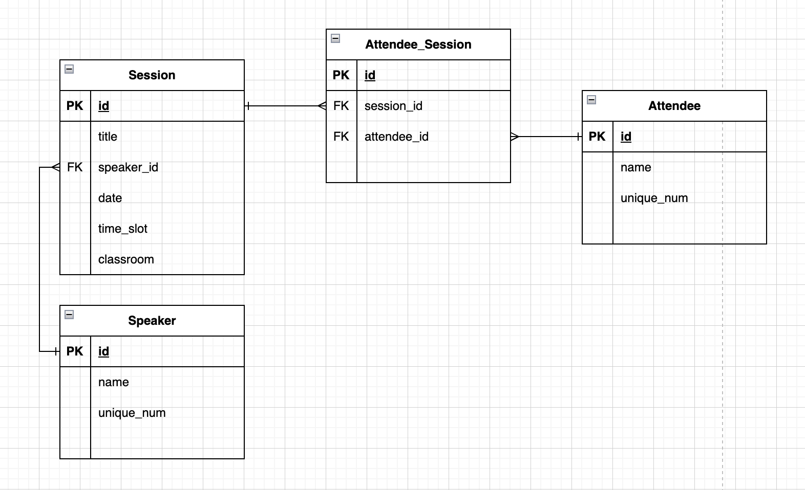
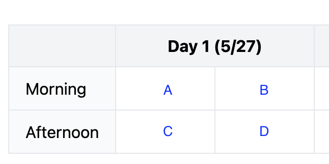

# Session Management System

## How to start the project

```bash
$ git clone xxx

# run client
$ cd client
$ npm install
$ npm run dev

# run server

```

## Data Schema



- The relationship between Session and Attendee (M:M)
  - Use Attendee_Session table to present
- The concept for the "classroom" field
  

## API doc

### GET /api/speakers

- Get all speakers
- response
  ```json
  [
    {
      "id": "b8b5105a-51df-47c8-a611-77c9ef6aaddb",
      "name": "John",
      "uniqueNum": "b8b5105a-51df-47c8-a611-77c9ef6aaddb"
    }
    // ...
  ]
  ```

### GET /api/sessions

- View all sessions
- response
  ```json
  [
    {
      "id": "61861579-3411-412f-a643-2c88b5b4e7d2",
      "title": "MySQL",
      "timeSlot": "morning",
      "speakerId": "35cae2ec-cca6-4d87-ad51-95977f846416",
      "date": 1716739200000,
      "classroom": "B"
    }
    // ...
  ]
  ```

### POST /api/sessions

- Create a new session
- Request
  ```json
  {
    "title": "MySQL",
    "timeSlot": "morning",
    "date": 1716739200000,
    "speakerId": "35cae2ec-cca6-4d87-ad51-95977f846416",
    "classroom": "B"
  }
  ```

### GET /api/attendees

- Get all attendees
- Response
  ```json
  [
    {
      "id": "e681fa48-46e4-4773-8f0c-083618b9ba80",
      "name": "James",
      "uniqueNum": "e681fa48-46e4-4773-8f0c-083618b9ba80"
    }
    // ...
  ]
  ```

### POST /api/attendee

- Create a new attendee
- Request
  ```json
  { "name": "James" }
  ```

### GET /api/attendee/{attendeeId}/sessions

- Retrieve all sessions for a specific attendee
- Response
  ```json
  [
    {
      "id": "61861579-3411-412f-a643-2c88b5b4e7d2",
      "title": "MySQL",
      "timeSlot": "morning",
      "speakerId": "35cae2ec-cca6-4d87-ad51-95977f846416",
      "date": 1716739200000,
      "classroom": "B"
    }
    // ...
  ]
  ```

### POST /attendee/{attendee}/session

- Register a specific attendee for a session
- Request
  ```json
  { "sessionId": "5adcd394-b7c8-4c0a-a43a-c47f21fc42e2" }
  ```
- Response

  ```json
  {
    "message": "success"
  }
  ```
